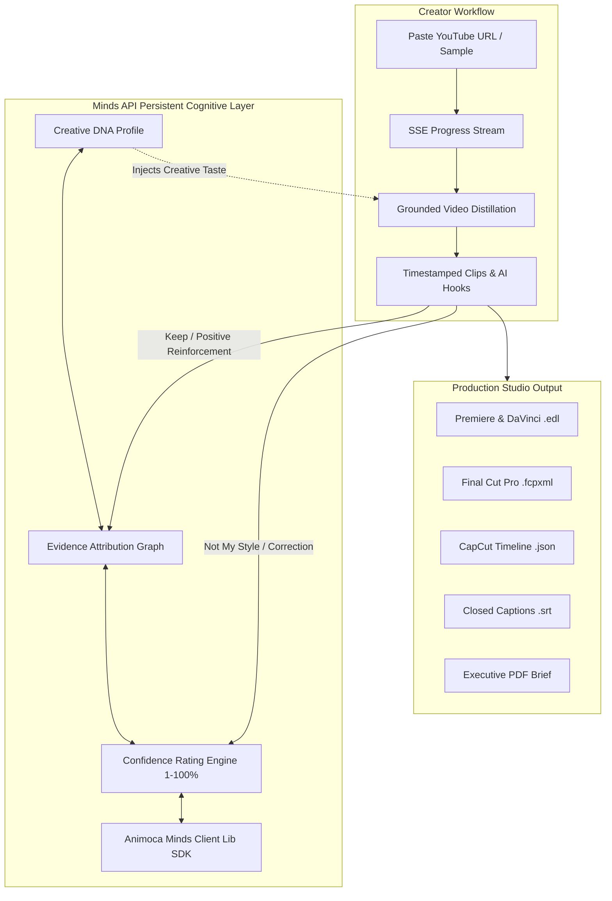

<div align="center">

# SoulCut

### **The AI-Native Creative Director Powered by Minds Persistent Memory**

*Transform long-form YouTube videos and podcasts into high-retention short-form video briefs and native NLE timelines—guided by your own evolving Creative Mind.*

<br/>

[](https://soulcut.onrender.com)
[](https://useminds.com/)
[](./docs/HACKATHON_PITCH_SCRIPT.md)

<br/>

[](https://www.typescriptlang.org/)
[](https://react.dev/)
[](https://trpc.io/)
[](https://groq.com/)
[](https://vitest.dev/)
[](https://opensource.org/licenses/MIT)

<br/>

[**Open Live App**](https://soulcut.onrender.com) • [**60s Judge Walkthrough**](https://soulcut.onrender.com/walkthrough) • [**Pitch Video Script**](./docs/HACKATHON_PITCH_SCRIPT.md) • [**Minds Integration**](#why-minds-is-the-cognitive-core-of-soulcut) • [**Quick Start**](#quick-start) • [**Architecture**](#repository-structure)

---

</div>

## The Core Problem & The Minds Solution

### The Problem: Stateless AI Has No Memory
Traditional AI video clippers generate generic, cookie-cutter clips because they operate in a vacuum. Every time you paste a video, the AI starts from scratch with zero memory of:
- Your pacing and hook style (e.g. *“I prefer contrarian hooks under 4 seconds”*).
- Your editorial boundaries (e.g. *“Never use corporate buzzwords or emojis”*).
- Your past approvals and rejections.

You are forced into an exhausting loop of repetitive prompt engineering and manual trimming.

### The Solution: SoulCut + Minds Cognitive Intelligence
**SoulCut solves this permanently by anchoring your creative workflow in a persistent Creative Mind powered by the Minds API (`@animocabrands/minds-client-lib`).**

Instead of prompt-stuffing, you teach your Creative Mind once. As you review clips—clicking **Keep** or **Not My Style**—your Mind dynamically records evidence, adjusts confidence weights (1–100%), and applies your evolving **Creative DNA** to every future video analysis.

---

## Why Minds is the Cognitive Core of SoulCut

SoulCut is deeply integrated with the **Animoca Brands Minds Protocol**:



### The 3 Pillars of Minds in SoulCut:

| Minds Pillar | How It Works in SoulCut |
| :--- | :--- |
| **1. Zero Blank Slates** | Your creative rules (voice, pacing, hook formats, audience profile) persist indefinitely in your Mind. No repeated system prompts needed. |
| **2. Evidence-Based Attribution** | Open any clip's *"Why does my Mind think this?"* card to see the exact evidence signals, past videos, and confidence scores behind the decision. |
| **3. Continuous Evolutionary Learning** | Clicking **Keep** reinforces editorial weights; clicking **Not My Style** documents corrections and reduces recurring mistakes automatically. |

---

## Official Minds SDK Integration (`@animocabrands/minds-client-lib`)

SoulCut connects directly to the Minds builder network using the official SDK:

```typescript
import {
  createMindsClient,
  getVerifiedBuilderMind,
  parseHumanIdFromBuilderApiKey,
} from "@animocabrands/minds-client-lib";

// Authenticate verified builder connection
const mindsClient = createMindsClient({
  apiKey: process.env.MINDS_API_KEY,
  baseUrl: process.env.MINDS_BASE_URL || "https://api.useminds.com",
});

// Verified Builder Human ID: 3c32483e-f36b-1410-8466-00039ce7df11
const builderMind = await getVerifiedBuilderMind(mindsClient);
```

### Architecture Highlights:
- **Verified Builder Human ID**: `3c32483e-f36b-1410-8466-00039ce7df11`
- **Bounded Context Snapshots**: Ensures creator memories are bounded and grounded strictly in verified video context.
- **Dual-Mode Sovereign Persistence**: Runs with full cloud MySQL or zero-config fast in-memory storage fallback.

---

## Key Features

### Grounded Video Distillation
- **Multi-Client YouTube Ingestion**: Extracts public transcripts via Innertube API with frame-accurate timestamp alignment.
- **Custom Transcript Ingestion**: Drag-and-drop `.srt`, `.vtt`, or `.txt` transcripts for private or unlisted video files.
- **Anti-Hallucination Grounding**: Timestamps and spoken quotes are strictly validated against verified source evidence.

### AI Hook Re-Angle Engine
Instantly reframe any clip opening hook into 4 high-retention formats matched to your Creative DNA:
- **Urgent / FOMO**: High-stakes urgency.
- **Question / Curiosity**: Open-loop curiosity hook.
- **Contrarian Hot Take**: Pattern-interrupt contrarian view.
- **Personal Story**: Emotionally grounded narrative hook.

### 9:16 Multi-Platform Safe-Zone Framing & Live Equalizer
- Segmented viewport switcher for **TikTok**, **Instagram Reels**, and **YouTube Shorts**.
- Accurately renders right-side UI buttons and bottom caption boundaries to prevent mobile UI overlap.
- Animated 4-bar green equalizer visualizer on active playing clip cards.

### Pro Studio NLE Timeline Exports
Instead of manually copy-pasting timecodes into editing software, export complete timeline sequences with one click:
- **CMX 3600 EDL (`.edl`)**: Direct timeline import for **Adobe Premiere Pro** and **DaVinci Resolve**.
- **Final Cut Pro XML (`.fcpxml`)**: Native multi-clip sequence for **Apple Final Cut Pro**.
- **CapCut Timeline JSON (`.json`)**: Formatted project file for **CapCut Desktop and Mobile**.
- **Closed Captions (`.srt`)**: Timed subtitles with custom hook overlays.
- **Executive PDF Briefs**: Professional, branded client reports with Minds persistent memory attribution.

---

## Mobile-First UX
SoulCut features a dedicated responsive mobile interface:
- **Sticky Segmented Tab Switcher**: Seamlessly switch between `Video & Brief`, `Mind & DNA`, and `Briefs Archive`.
- **1-Click Sample Pills**: Smooth horizontal scrolling for quick sample ingestion on mobile phones.
- **2x2 Responsive Stats Grid**: Clean, high-density performance cards.

---

## Quick Start

### 1. Clone the Repository
```bash
git clone https://github.com/0xaje/Soulcut.git
cd Soulcut
npm install
```

### 2. Configure Environment Secrets
Copy `.env.example` to `.env`:
```bash
cp .env.example .env
```

Fill in your API credentials in `.env`:
```ini
# Application
NODE_ENV=development
PORT=3000
VITE_APP_TITLE=SoulCut

# Minds API (Animoca Brands Persistent Memory)
MINDS_API_KEY=your_minds_jwt_or_builder_key
MINDS_BASE_URL=https://api.useminds.com
MINDS_APP_ID=6732483e-f36b-1410-8466-00039ce7df11
MINDS_MIND_ID=6732483e-f36b-1410-8466-00039ce7df11

# LLM Inference Engine (Groq Cloud)
BUILT_IN_FORGE_API_URL=https://api.groq.com/openai/v1
BUILT_IN_FORGE_API_KEY=gsk_your_groq_api_key
LLM_MODEL=openai/gpt-oss-120b

# Session Secret
JWT_SECRET=your_32_character_jwt_secret_key
```

### 3. Start Development Server
```bash
npm run dev
```
Open **`http://localhost:5173`** (or `http://localhost:3000`) in your browser.

---

## Testing & Verification

SoulCut includes a comprehensive Vitest test suite covering end-to-end user journeys, Minds API integration, worker queues, and NLE timeline exports:

```bash
# Run 90 automated tests
npm test

# Typecheck TypeScript code
npm run check

# Verify live API pipelines (LLM, Minds, Job Queue, PDF)
npx tsx server/verify_apis.ts

# Production build
npm run build
```

---

## Repository Structure

```
Soulcut/
├── client/                     # Frontend SPA (React 18, Vite, TailwindCSS)
│   ├── src/
│   │   ├── pages/              # Workspace, Landing, CreativeDNA, Evolution, Walkthrough
│   │   ├── components/         # 9:16 Player, MindEvidenceDetails, Equalizer, Modals
│   │   └── lib/                # tRPC client, NLE timeline exporters, helpers
├── server/                     # Backend API & Worker Engine (Express, tRPC v11, Node.js)
│   ├── _core/                  # Server bootstrap, LLM client, tRPC context
│   ├── routers/                # mind.ts (reangleHook, DNA, sync), videoJobs.ts, auth.ts
│   ├── mindsBuilder.ts         # @animocabrands/minds-client-lib SDK integration
│   ├── videoAnalysis.ts        # Grounded LLM narrative distillation & schema validation
│   ├── analysisWorker.ts       # Durable background job processor & retry worker
│   ├── analysisProgressStream.ts # Real-time SSE progress streaming
│   ├── timelineExporters.ts    # CMX 3600 EDL, FCPXML, CapCut JSON generators
│   ├── jobPdfReport.ts         # Executive PDF report generation
│   ├── db.ts                   # Dual-mode persistence (MySQL + In-Memory Fallback)
│   └── verify_apis.ts          # End-to-end live health verification script
├── docs/                       # Complete documentation space
│   ├── HACKATHON_PITCH_SCRIPT.md # 2-minute pitch blueprint & storyboard
│   ├── GETTING_STARTED.md      # Step-by-step user and deployment manual
│   └── ARCHITECTURE.md         # Technical architecture & cognitive memory design
├── package.json
└── tsconfig.json
```

---

## Hackathon Submission Highlights

- **Live Production URL**: [https://soulcut.onrender.com](https://soulcut.onrender.com)
- **Interactive 60s Walkthrough**: [https://soulcut.onrender.com/walkthrough](https://soulcut.onrender.com/walkthrough)
- **Master Video Pitch Blueprint**: [`docs/HACKATHON_PITCH_SCRIPT.md`](./docs/HACKATHON_PITCH_SCRIPT.md)
- **Minds Protocol**: Built with `@animocabrands/minds-client-lib`

---

## License

This project is licensed under the [MIT License](LICENSE).
