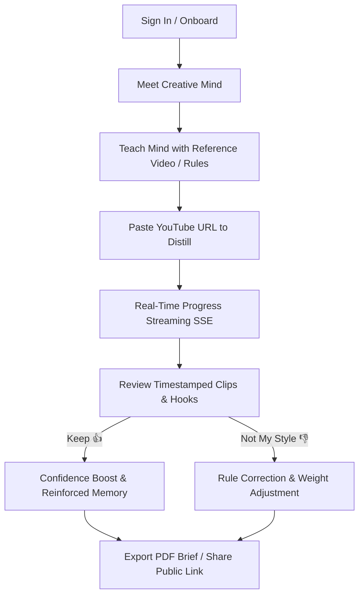

<div align="center">

# 🎬 SoulCut

### **AI-Native Creative Director for High-Retention Short-Form Distillation**

*Transform long-form YouTube videos and podcasts into viral short-form video briefs powered by your own persistent, evolving Creative Mind.*

[](https://www.typescriptlang.org/)
[](https://react.dev/)
[](https://trpc.io/)
[](https://useminds.com/)
[](https://groq.com/)
[](https://vitest.dev/)

[**Quick Start**](#-quick-start) • [**Documentation**](./docs/GETTING_STARTED.md) • [**Architecture**](./docs/ARCHITECTURE.md) • [**Workflow**](#-core-workflow) • [**Configuration**](#-configuration)

---

</div>

## 💡 What is SoulCut?

Traditional video AI tools generate generic, cookie-cutter clips because they have **no memory** of what you actually like. 

**SoulCut is different.** It combines **Groq's ultra-fast LLM inference** with **Minds API persistent memory** to create a personalized AI Creative Director that:
1. **Remembers Your Style**: Learns your pacing, hook preferences, emotional resonance rules, and editing aesthetics.
2. **Evolves With Every Clip**: Improves its recommendations over time as you accept (`Keep`) or reject (`Not My Style`) suggestions.
3. **Distills Long-Form Content**: Automatically analyzes hours of footage to isolate high-impact short-form clips with exact timestamps, hook scripts, and virality rationales.
4. **Client-Ready Deliverables**: Generates branded PDF briefs and tokenized, secure public share links for your editors and clients.

---

## ✨ Core Features

### 🧠 Persistent Creative Mind
- **Creative DNA Profile**: Maintains explicit, auditable memory records of your editorial preferences.
- **Confidence Scoring**: Each rule has a dynamic confidence rating (1–100%) reinforced by evidence from real videos.
- **Teach Your Mind**: Train your AI by analyzing reference YouTube videos or writing direct creator rules.

### ⚡ Grounded Video Distillation
- **Instant YouTube Ingestion**: Paste any public YouTube link to extract summary narratives, topic pillars, and timestamped clips.
- **Transcript Support**: Attach `.txt`, `.srt`, or `.vtt` caption files for frame-accurate timing.
- **Anti-Hallucination Grounding**: Clip boundaries and quotes are strictly validated against verified transcript timestamps.

### 🔄 Adaptive Feedback Loop
- **Positive Reinforcement (`Keep`)**: Boosts the weight and confidence of the editorial rules that produced the clip.
- **Corrective Feedback (`Not My Style`)**: Adjusts weighting and documents corrective guidance to avoid recurring mistakes.
- **Evidence Audit Trail**: Inspect the exact history of prompts, videos, and feedback that shaped any rule.

### 📡 Real-Time SSE Progress Stream
- Live visual updates as your video moves through stages:
  `Reading Metadata` ➔ `Distilling Narrative` ➔ `Shaping Viral Clips` ➔ `Complete`.

### 📄 Executive PDF Briefs & Public Sharing
- Download clean, printable executive PDF summaries of every video distillation.
- Create time-limited, passwordless public share links with custom studio branding.

### 🛡️ Dual-Mode Resilient Storage
- **Zero-Barrier Setup**: Automatically operates with an ultra-fast in-memory fallback store when no database is configured.
- **Production MySQL**: Plug in any MySQL database (`DATABASE_URL`) for persistent enterprise storage.

---

## 🚀 Quick Start

### 1. Clone & Install

```bash
git clone https://github.com/0xaje/Soulcut.git
cd Soulcut
npm install
```

### 2. Configure Environment

Copy the example environment template:

```bash
cp .env.example .env
```

Add your **Groq API Key** and **Minds API** credentials in `.env`:

```env
VITE_APP_TITLE=SoulCut

# Minds Persistent Memory
MINDS_API_KEY=your_minds_jwt_or_api_key
MINDS_BASE_URL=https://api.useminds.com
MINDS_APP_ID=your_mind_id
MINDS_MIND_ID=your_mind_id

# AI Engine (Groq Fast Inference)
BUILT_IN_FORGE_API_URL=https://api.groq.com/openai
BUILT_IN_FORGE_API_KEY=gsk_your_groq_api_key
LLM_MODEL=llama-3.3-70b-versatile
```

### 3. Run Development Server

```bash
npm run dev
```

Visit [`http://localhost:3000`](http://localhost:3000) in your browser.

---

## 🎯 Core Workflow



1. **Meet Your Mind**: Complete the quick onboarding to set baseline energy, pacing, and visual style.
2. **Teach Your Mind**: Paste a reference video or type editing preferences to build your **Creative DNA**.
3. **Distill Videos**: Paste a long-form YouTube URL and watch the real-time analysis stream.
4. **Iterate & Refine**: Use the 👍 / 👎 buttons on clip suggestions to evolve your Mind's editorial accuracy.
5. **Export & Share**: Generate client PDF reports or tokenized share links.

---

## 📂 Repository Structure

```
Soulcut/
├── client/                     # Frontend Application (React 18, Vite, Tailwind)
│   ├── src/
│   │   ├── pages/              # Landing, Workspace, Onboarding, Shared Brief
│   │   ├── components/         # Workspace UI, Creative DNA, Clip Cards, Modals
│   │   └── lib/                # tRPC client, state management, audio utilities
├── server/                     # Backend API & Workers (Express, tRPC v11, Node.js)
│   ├── _core/                  # Server bootstrap, OAuth, LLM adapter, tRPC context
│   ├── routers/                # tRPC endpoints (mind, videoJobs, auth)
│   ├── analysisWorker.ts       # Durable background job processor & worker pool
│   ├── videoAnalysis.ts        # Grounded LLM distillation & JSON schema validation
│   ├── mindAnalysisContext.ts  # Snapshot builder for active creator preferences
│   ├── mindsAdapter.ts         # Minds SDK / HTTP REST synchronization bridge
│   ├── jobPdfReport.ts         # PDF generation engine
│   └── db.ts                   # Dual-mode database layer (MySQL + In-Memory Store)
├── drizzle/                    # Database schema definitions & migrations
├── docs/                       # Comprehensive documentation space
│   ├── GETTING_STARTED.md      # Detailed step-by-step user & deployment guide
│   ├── ARCHITECTURE.md         # Technical architecture & memory design
│   └── minds-transformation-audit.md
├── package.json
└── tsconfig.json
```

---

## 🧪 Testing & Validation

SoulCut includes a robust Vitest test suite covering end-to-end user journeys, worker execution, memory evolution, and UI components:

```bash
# Run all tests
npm test

# Run TypeScript validation
npm run check

# Production build
npm run build
```

---

## 📚 Detailed Documentation

For in-depth guides, visit the documentation space in [`docs/`](./docs):
- [**Getting Started & User Guide**](./docs/GETTING_STARTED.md)
- [**Technical Architecture & Memory Design**](./docs/ARCHITECTURE.md)
- [**Minds API Transformation Audit**](./docs/minds-transformation-audit.md)

---

## 📄 License

This project is licensed under the MIT License.
